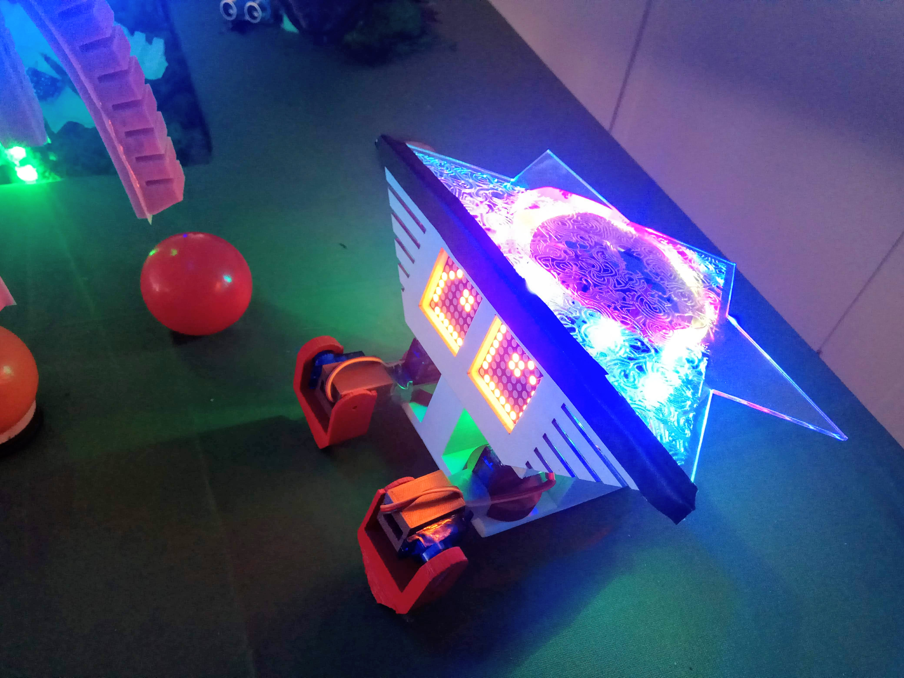

# Jaadu : the Alien in FabTerrarium

A **FabTerrarium** is a space with different animals/plants which can interact with users or other entities within the terrarium. These animals/plants are either 3D prninted or soft-robots or a combination of both.

**Jaadu** is an alien in the FabTerrarium who is curious about the different animals or plants in the space. It is a small toddler who crawls in the terrarium reading the emotions of the other entities and displaying those emotions in itself.

**PowerHand** is the movement controller for the Alien. Moving it around triggers the Alien to move.

**Emotion Gateways** are the gateways placed in the Terrarium through which the Alien can pick up emotions of other entities.

Read more at our [blog](https://students.hci.rwth-aachen.de/category/ws1819/mcp-ws1819-group2) on the project and how it came to be.

## Repo Details

* **alien** : Contains the code for the Alien.
* **backdoor** : Contains the client side code for communicating with the backdoor over MQTT.
* **ground** : Contains the code for synchronization between the Emotion Gateways and sending the triggers in the ground to the Alien.
* **media** : Different images/videos used in the repo.
* **models** : All models designed for laser cutting or 3D printing, some discarded and some used.
* **powerhand** : Code for control of LEDs and triggers sent to Alien in the PowerHand.
* **scripts** : Contains scripts used in the project.
* **testing_modules** : Testing codes and information.

## Items used

* **Alien :**
  * RasPI Zero W
  * Adafruit RGB LED Strip
  * Adafruit LED 8x8 Matrix (2)
  * TowerPro SG90 Servo (4)
* **PowerHand :**
  * Arduino Nano
  * Accelerometer
  * HC-05 Bluetooth Module
  * Adafruit RGB LED Strip
* **Ground :**
  * Arduno Uno
  * HC-05 Bluetooth Module
  * HC-SR04 Ultrasonic Sensor (2)
  * Adafruit RGB LED Strip (2)
* **Additionally :**
  * Finnappee
  * PlexiGlas
  * PLA
  * Breadboard
  * Jumper Cables
  * Tapes
  * Loads and loads of Glue

# Thoughts on looking back

* The walking mechanism developed which relies on the Servos is not suitable to be driven by a RasPI. The Servos by TowerPro are not really reliable and go bust often. A better and reliable mechanism is needed.
* Bluetooth HC-05 module keeps disconnecting after some time, not reliable.
* RaspPi Zero W with it's single core is not a good driver for 7 threads. Things get real slow real quick. RasPI 3 might be a better alternative.
* PowerHand doesn't have proper signifiers for how to use it. Design could be better.
* Power requirements for the LED Matrix, LED Strip is quite high. A 1.5A current (given out usually a small powerbank) is not sufficient. A smaller, light-weight and higher output current power source should be thought of.

---

The **Interactive FabTerrarium** project was conducted as the **Media Computing Project** by the [Media Computing Group](https://hci.rwth-aachen.de/) group under [RWTH Aachen](http://www.rwth-aachen.de).
