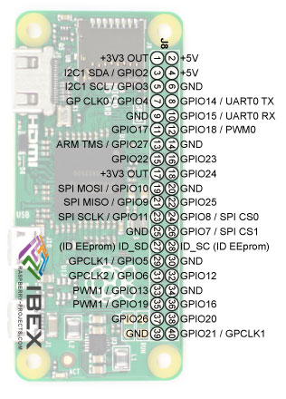

# Alien

The central controller for all the different individual components inside the Alien.

## Wiring

**Note :** Servos are driven by external power (RasPI can't bear the load). All VCC and GND for Servos need to be connected to the external source. External power source GND also has to be connected with RasPI GND.

<table>
  <tr>
    <th> Connection </th><th> Right </th><th> RasPI Zero W Board </th><th> Left </th><th> Connection </th>
  </tr>
  <tr>
    <td></td><td>1</td><td rowspan=20>  </td> <td>2</td><td>VCC OUT</td>
  </tr>
  <tr>
    <td>Left Eye SDA</td><td>3</td><td>4</td><td></td>
  </tr>
  <tr>
    <td>Left Eye SCL</td><td>5</td><td>6</td><td>GND OUT</td>
  </tr>
  <tr>
    <td></td><td>7</td><td>8</td><td></td>
  </tr>
  <tr>
    <td></td><td>9</td><td>10</td><td></td>
  </tr>
  <tr>
    <td></td><td>11</td><td>12</td><td>LED DOUT</td>
  </tr>
  <tr>
    <td></td><td>13</td><td>14</td><td></td>
  </tr>
  <tr>
    <td></td><td>15</td><td>16</td><td>Right Eye SDA</td>
  </tr>
  <tr>
    <td></td><td>17</td><td>18</td><td>Right Eye SCL</td>
  </tr>
  <tr>
    <td></td><td>19</td><td>20</td><td></td>
  </tr>
  <tr>
    <td></td><td>21</td><td>22</td><td>Right Leg CTRL</td>
  </tr>
  <tr>
    <td></td><td>23</td><td>24</td><td></td>
  </tr>
  <tr>
    <td>GND for External Power</td><td>25</td><td>26</td><td></td>
  </tr>
  <tr>
    <td></td><td>27</td><td>28</td><td></td>
  </tr>
  <tr>
    <td></td><td>29</td><td>30</td><td>GND OUT</td>
  </tr>
  <tr>
    <td></td><td>31</td><td>32</td><td></td>
  </tr>
  <tr>
    <td></td><td>33</td><td>34</td><td></td>
  </tr>
  <tr>
    <td></td><td>35</td><td>36</td><td>Left Leg CTRL</td>
  </tr>
  <tr>
    <td>Right Foot CTRL</td><td>37</td><td>38</td><td>Left Foot CTRL</td>
  </tr>
  <tr>
    <td></td><td>39</td><td>40</td><td></td>
  </tr>
</table>

## Installation

Run the [script](../scripts/) to complete installation of the alien package inside RasPI.
Starts the Alien program automatically as a service on the RasPI.

## Some things to take care

Changes in **lib/globals.py** :

* **EXTERNAL_BROKER_HOST** needs to point to the IP address of the MQTT Broker.
* **EXTERNAL_BROKER_PORT** needs to be changed if the Broker listens at a different port (1883 is default)
* **WALKING_PINS** are RasPI GPIO pin numbers and need to be changed if the connection is made different from as given.
* **MOVE_CONTROL_VALUES** are experimental values. The exact values change depending on how the Alien legs are screwed in.
Experiments can be done using [this](../testing_modules/pigpio_test/servo_demo.py).
* **WALKING_PINS** has GPIO pin numbers. Need to be changed if using different connection.
* **HAND_BLUETOOTH_MAC** according to the MAC of the powerhand Bluetooth device.
* **GROUND_BLUETOOTH_MAC** according to the MAC of the ground connected Bluetooth device.
* **LED_STRIP_PIN** is the GPIO pin number. Change if using different connections.
* **NUM_PIXELS_USED** change according to number of LEDs in the strip used in Alien.

Changes in **mqtt_topic_mappings.json** :

Change the topic on which the emotions are sent by the other entities in the terrarium and unique key we will be using to track those emotions.
